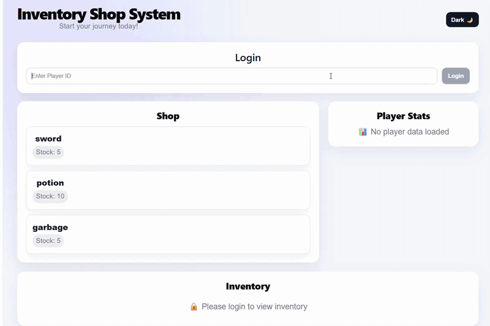

# Inventory Shop System (Full-Stack)

A full-stack RPG simulation system with authentication, shop economy, inventory, and combat mechanics, built using a production-style FastAPI service-layer architecture and React frontend.

---

## 🎮 Live Demo

Real-time gameplay simulation with shop transactions, inventory updates, and player progression.

---

## 🧠 Core Design Philosophy

This project is designed to reflect **production-style backend engineering practices**, not just feature implementation.

Key principles:
- Clear separation between frontend and backend systems
- Stateless REST API design with token-based authentication
- Server-authoritative game state (no client-side trust)
- Modular service-layer architecture for business logic isolation
- Dependency injection for authentication and validation
- Redis caching layer for optimizing frequently accessed data (e.g., shop items, player state) and reducing database load
- Fully testable and deterministic backend logic

The goal is to simulate real-world backend system design patterns used in production applications.

---

## 🏗 System Architecture

React Frontend → FastAPI Routes → Service Layer (Game Logic) → Redis Cache → SQLite Database

Key properties:
- Thin controller layer (FastAPI routes handle request/response only)
- Centralized business logic in service layer (`Game` domain object)
- Redis caching layer for high-frequency data access (shop, player state)
- Dependency injection for authentication and player validation
- Transaction-safe database operations via SQLAlchemy
- Stateless REST API design

---

## ⚙️ Core Features

### 👤 Player System
- Persistent player profiles (gold, HP, level, XP)
- Server-authoritative state management
- Secure authorization via dependency layer
- Real-time stat updates from backend source of truth

### 🛒 Shop System
- Dynamic item listings with stock tracking
- Buy/sell transactions with full server-side validation
- Enforced pricing and inventory rules

### 🎒 Inventory System
- Player-specific persistent inventory
- Fully backend-synced state after transactions

### ⚔️ Combat System
- Server-side combat simulation implemented in backend service layer
- Deterministic outcome system (win/lose based on defined game rules)
- Enemy-specific XP and gold rewards
- Randomized loot drops with configurable drop tables
- Automatic inventory updates after combat rewards
- Event-driven state updates handled through service layer architecture

### 📜 Quest System
- Tracks progress toward enemy kill objectives
- Supports enemy-specific kill requirements
- Automatic progress updates after combat
- Quest completion handled through backend service logic

### 📊 Stats System
- Live player stats from backend state
- No client-side state authority

---

## 🔐 Authentication & Security

- Token-based authentication via request headers
- Route-level authorization enforcement
- Player-scoped data access control
- Dependency injection-based validation (`getAuthorizedGame`)
- Pydantic request validation
- Rate limiting for abuse prevention

---

## 📡 API Overview

### Authentication
- `POST /login/{playerId}` → returns session token

Response:
{
  "success": true,
  "data": {
    "token": "abc123"
  }
}

---

### Player
- `GET /player/{playerId}` → get player stats

Response:
{
  "success": true,
  "data": {
    "gold": 100,
    "hp": 100,
    "level": 1,
    "xp": 0
  }
}

---

### Shop
- `GET /shop` → list items
- `POST /buy/{playerId}` → purchase item (validated)
- `POST /sell/{playerId}` → sell item (validated)

Response:
{
  "success": true,
  "data": [
    {
      "itemName": "sword",
      "stock": 5,
      "price": 20
    }
  ]
}

---

### Inventory
- `GET /inventory/{playerId}` → view inventory

---

### System
- `GET /health` → health check

---

## 🎨 Frontend (React)

### Structure
- `App.jsx` → API orchestration layer + global state
- `Login.jsx` → Authentication UI
- `Shop.jsx` → Shop interface
- `Inventory.jsx` → Inventory management
- `PlayerStats.jsx` → Live stats display
- `combatPanel.jsx` -> Basic Combat System

### Features
- Component-based architecture
- API-driven state updates
- Loading and error states
- Toast notifications for actions
- Dark/light mode support

---

## 🧱 Backend Architecture

### FastAPI Layer (Controllers)
- Handles routing + request validation
- Delegates all logic to service layer
- Keeps endpoints thin and maintainable

### Service Layer (Game Logic)
- Core business logic (buy/sell/combat)
- Player state updates
- Encapsulated domain rules

### Dependency Layer
- Authentication + authorization
- Player validation
- Game session resolution (`getAuthorizedGame`, `getGame`)

### Database Layer
- PostgreSQL (Neon hosted production database)
- SQLAlchemy ORM for database interaction
- Alembic for version-controlled database migrations
- Transaction-safe persistence
- Schema evolution managed via migrations instead of manual SQL

### Asynchronous Task Layer (Celery + Redis)
- Background task processing system using Celery with Redis as a message broker
- Designed to offload non-critical or heavy operations from the request/response cycle
- Supports scalable architecture for future high-load workloads

Planned use cases:
- Asynchronous player state persistence
- Background event generation (combat events, loot drops, economy updates)
- Analytics and gameplay telemetry logging

---

## 🧪 Testing & Quality

- Pytest-based test suite
- Unit tests for service logic
- Integration tests for API routes
- Edge case coverage (invalid input, insufficient stock, unauthorized access)
- CI pipeline runs tests on every commit

---

## 💡 What This Project Demonstrates

- Production-style full-stack system design
- Service-layer backend architecture (controller → domain → persistence)
- Secure REST API design with authentication & authorization
- Dependency injection patterns for scalable backend design
- Test-driven development using Pytest
- CI/CD pipeline with GitHub Actions
- Real-world state management across frontend/backend
- Backend observability through structured logging

---

## 🛠 Tech Stack

- FastAPI
- Python
- React (Vite)
- JavaScript (ES6+)
- SQLAlchemy
- PostgreSQL (Neon)
- Alembic (Database Migrations)
- Redis (Caching layer)
- Token-based authentication
- Pytest
- GitHub Actions
- Codecov

--- 

## 🚀 How to Run 

- 🖥️ Local (No Docker)

### Backend
- pip install -r requirements.txt
- uvicorn app.main:app --reload

### Frontend
- cd frontend
- npm install
- npm run dev

### 🐳 Docker (Recommended)

- Run full stack (frontend + backend + database):

- docker compose up --build

### 🌐 Links
- API Docs: https://inventoryshopsystem.onrender.com/docs
- Live Demo: https://inventoryshopsystem.vercel.app/

---

## 🚀 CI/CD & Quality

- Automated testing via GitHub Actions
- Full test suite runs on every push
- Code coverage tracking via Codecov
- CI prevents broken builds from merging
- Structured logging for debugging and observability
- Rate limiting for API protection

---

## ⚡ Performance Optimization

- Redis caching reduces database queries for frequently accessed game data
- Improves response times for shop and player endpoints
- Enables scalable architecture for future multiplayer expansion

---

## ☁️ Production Infrastructure

- Database hosted on Neon (serverless PostgreSQL)
- Schema migrations managed via Alembic
- Backend deployed on Render
- Frontend deployed on Vercel
- Environment-based configuration using `.env`

---

## 📈 Summary

This project demonstrates a full-stack RPG simulation system built with **production-grade backend engineering principles**, including service-layer architecture, authentication and authorization design, transactional state management, automated testing, and CI/CD workflows.

It reflects real-world backend system design patterns used in scalable web applications.